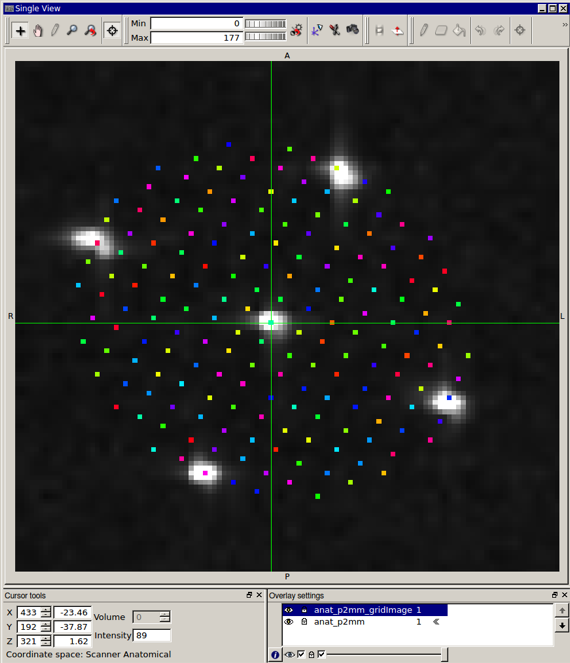
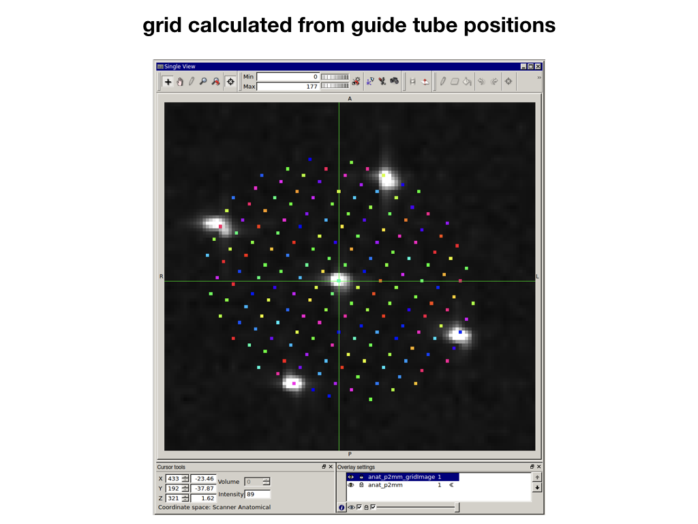
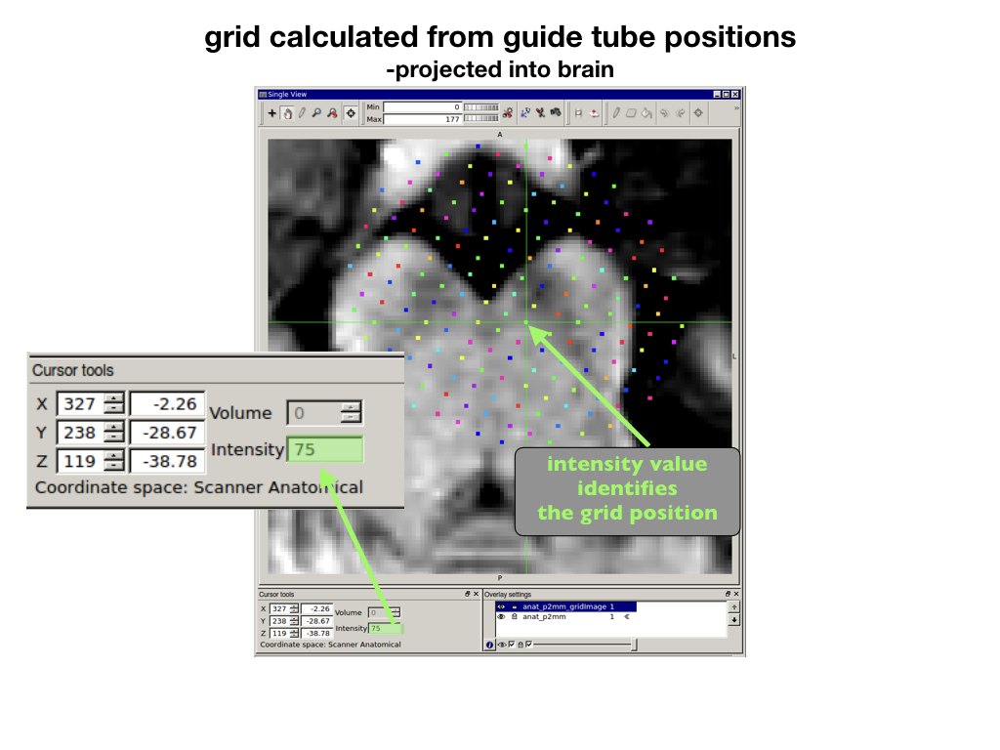
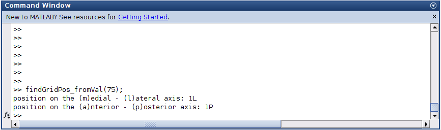

# gridFromGuideTubes
calculates a grid and projects it through the brain.
based on position of 3 or more guide tubes

 

## file locations

specify location of guide tube mask and anatomy

	currDIR = '/data/location/here/';
	imageLocation.guideTubeMask = [currDIR, '/mask.nii'];
	imageLocation.anatomy = [currDIR, '/anat.nii'];

## specify guide tube voxel thresolds

**guideTube_greater** specify whether to look for hyperintense (bright) or hypointense (dark) guide tube voxels:
-voxels > threshold;  guideTube_greaterThen = 1
-voxels < threshold; guideTube_greaterThen = 0

	guideTube.isGreaterThen = 1;
	
**guideTube_threshold** specify the threshold to be used to determine which voxels within the mask are guide tube voxels.

	guideTube.threshold = 200;

find center of guide tube using the mean position weighted by voxel intensity

	guideTube.isWeightedMean = 1;

Is a sparse guide tube mask used?

	guideTube.sparseGT = 0;

## grid position definition
definition of grid positions of each guide tube mask 
-mask with valune **n** in guideTubeMask_imageName
 should be speicifed with gridpos(**n**)
	 
	clear gridpos
	gridpos(1).positionNameAP = 'C';
	gridpos(1).positionNameLM = 'C';

	gridpos(2).positionNameAP = '7A';
	gridpos(2).positionNameLM = 'C';

	gridpos(3).positionNameAP = '7P';
	gridpos(3).positionNameLM = 'C';

	gridpos(4).positionNameAP = 'C';
	gridpos(4).positionNameLM = '7L';

	gridpos(5).positionNameAP = 'C';
	gridpos(5).positionNameLM = '7M';

must be >= 2 grid positions per LM and AP axis :
- LM = lateral to medial line
- AP = same anterior to posterior line
	gridpos_same_LM = [1 2 3];
	gridpos_same_AP = [1 4 5];

## check image orientation 
dimOrder change order of dimensions to  [1=Coronal, 2= Transverse, 3 = Sagittal]

-example below flips the 2 and 3 dimensions

	dimOrder = [1 3 2];

flipVals - flip volume orders so dimensions increase from: [dorsal-ventral  anterior-posterior left-right]

-example below flips the d-v and the l-r dimensions	

	flipVals = [1 1 1];

checkVolOrientation make sure volume in correct orientation
necessary for further calculations!

	checkVolOrientation(Anat_imageName,dimOrder,flipVals);

## execute
makes grid image

	make_grid_image(imageLocation, imageOrient, guideTube, gridpos);

## output
grid calulated from guidetubes and projected into brain
*_gridImage.nii
 

## use grid number to find position
use grid number from *_gridImage.nii 
to find grid position in A-P and L-M 

 

converts number to grid position

	findGridPos_fromVal(75);
	
 
